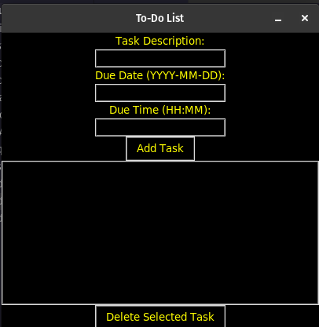
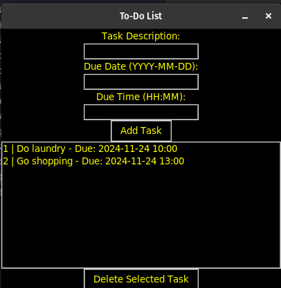
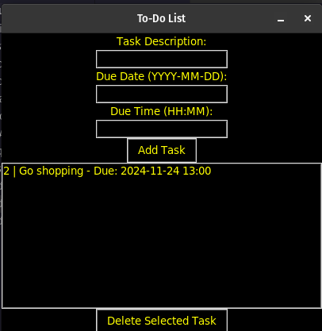

git clone https://github.com/OfentseMabalane1/todolist.git
cd todolist

Create a Virtual Environment (optional but recommended):

bash
python3 -m venv venv
source venv/bin/activate  # Use `venv\Scripts\activate` on Windows

Install Required Dependencies:
Ensure you have a requirements.txt file in your project directory. Install dependencies with:

bash
pip install -r requirements.txt

If you don't have a requirements.txt, install dependencies manually:

bash
pip install tk sqlite3 pickle5

Run the Application:
After setting up, run the application using:

bash
python todo.py

Usage
Upon starting the application, users will interact with several key elements:

    Task Description: Input field for task descriptions.
    Due Date: Input field for due dates (format: YYYY-MM-DD).
    Due Time: Input field for due times (format: HH:MM).
    Task List: Displays all tasks along with their due dates and times.
    Delete Task: Allows users to select and delete tasks from the list.

Screenshots
The application features several screens to enhance user experience:

License
This project is open-source and available under the MIT License. For more details, refer to the LICENSE file.
Acknowledgements
This application was developed by Keitumetse Mabalane as part of a learning initiative in building a To-Do List application using Python. Special thanks to Tkinter for the GUI framework and SQLite for database management. The integration of Pickle allows for efficient serialization of task data, enabling users to save their work seamlessly.